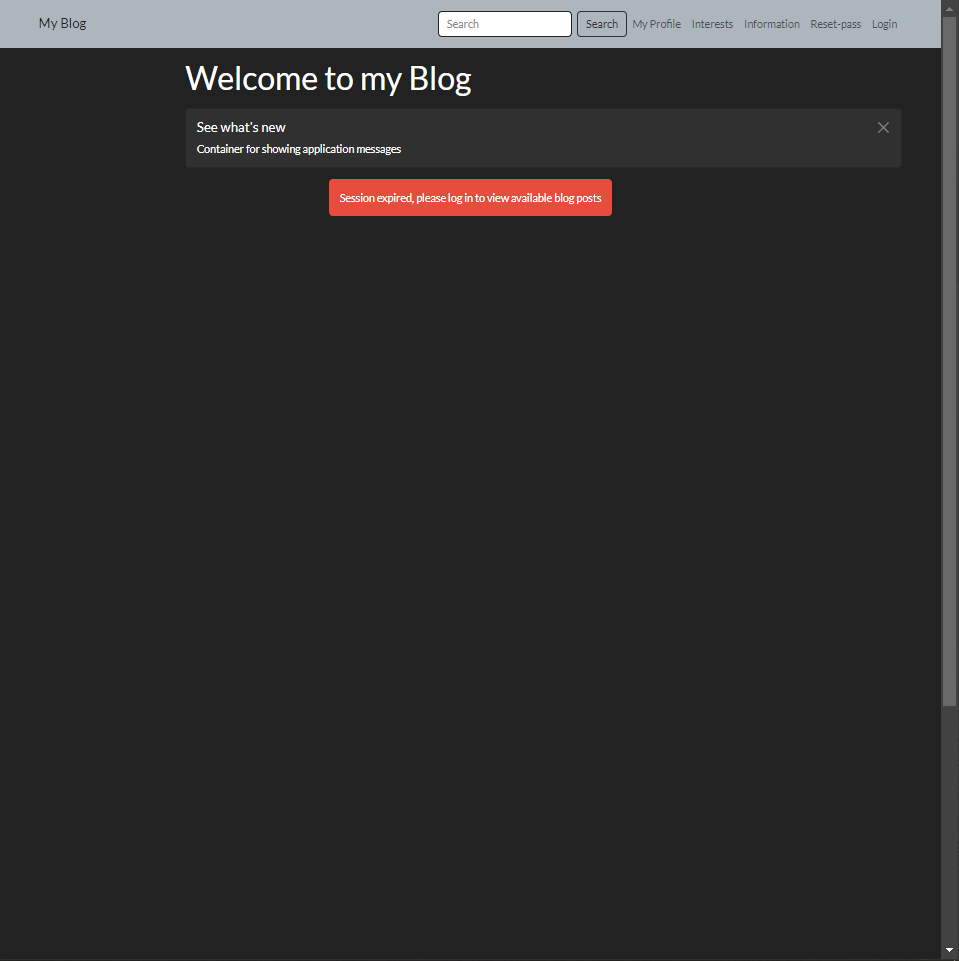
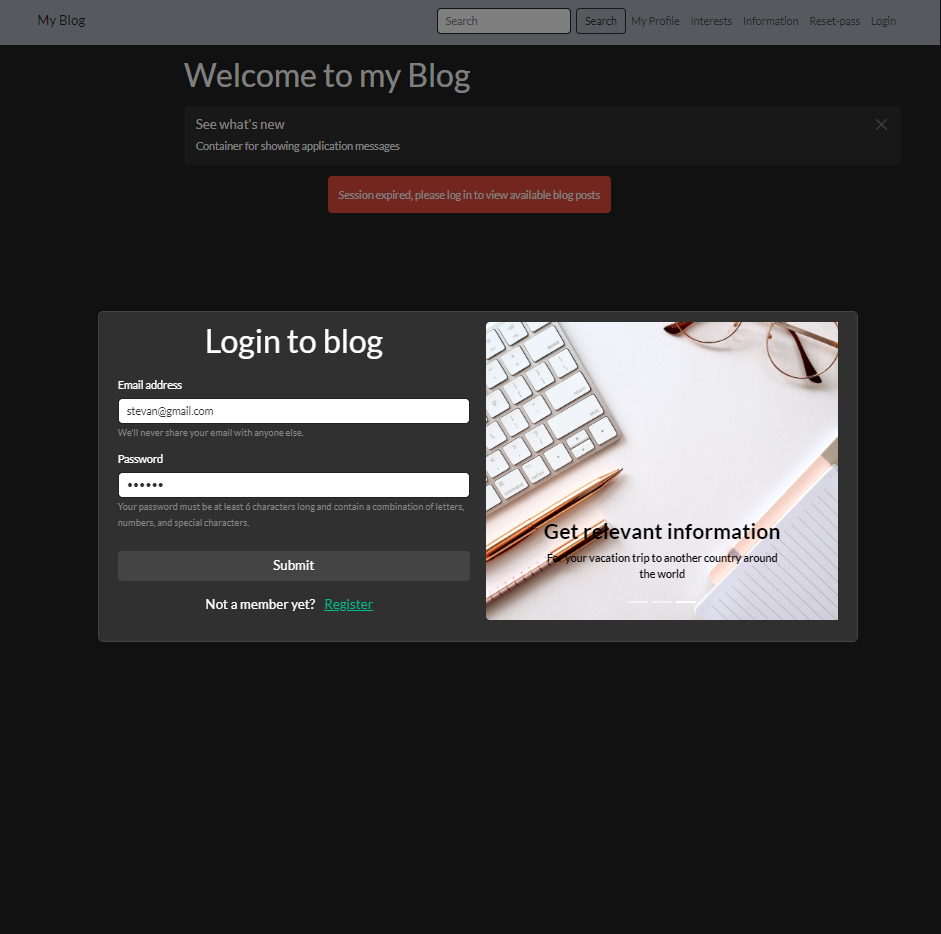
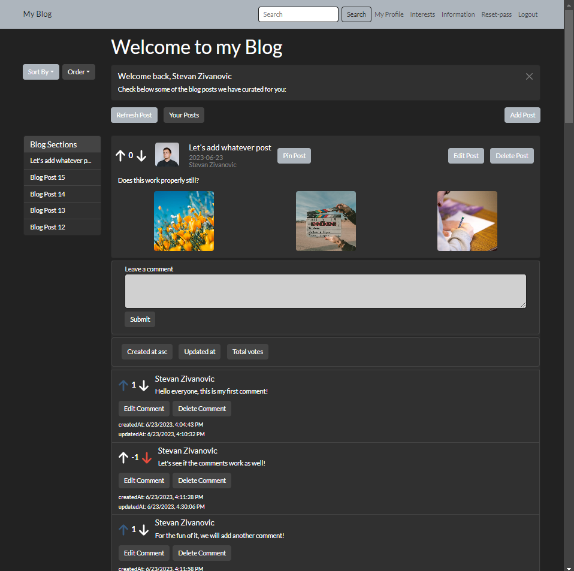
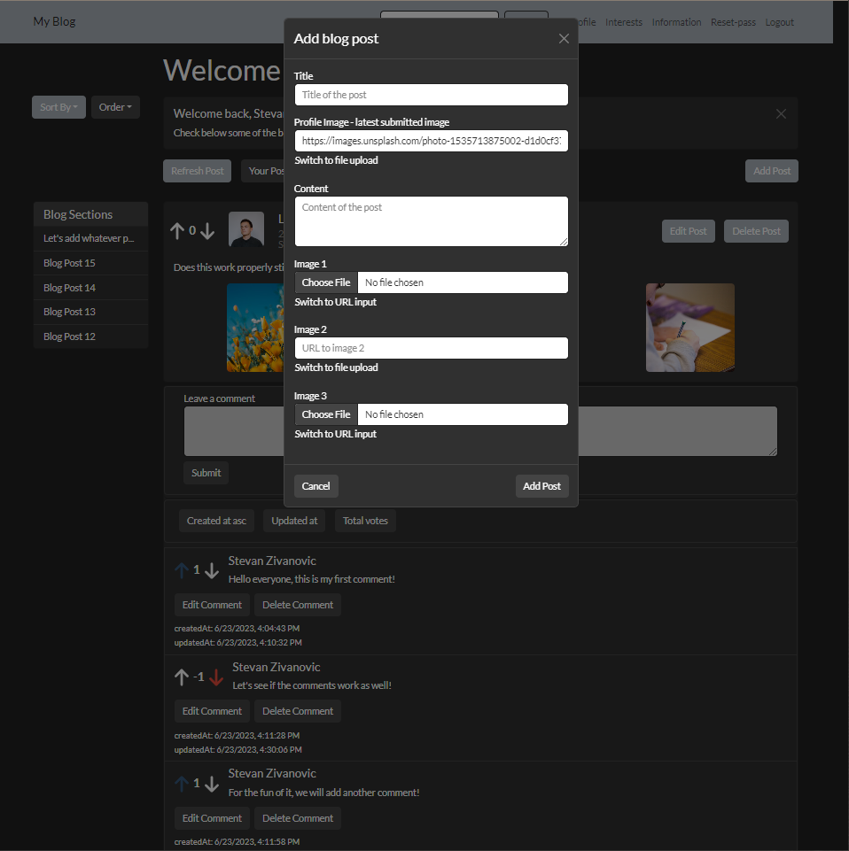
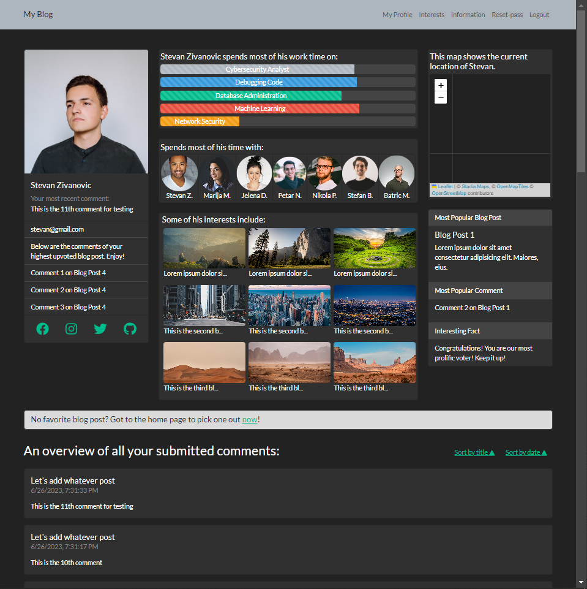
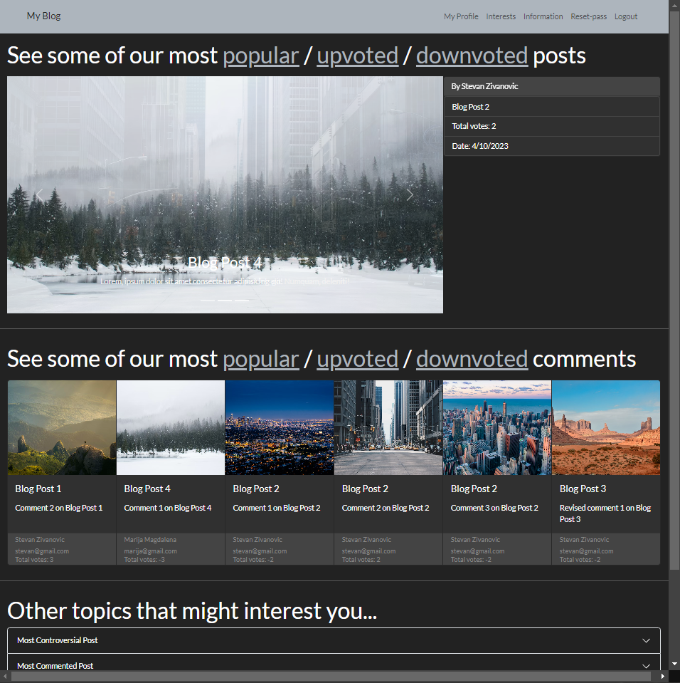
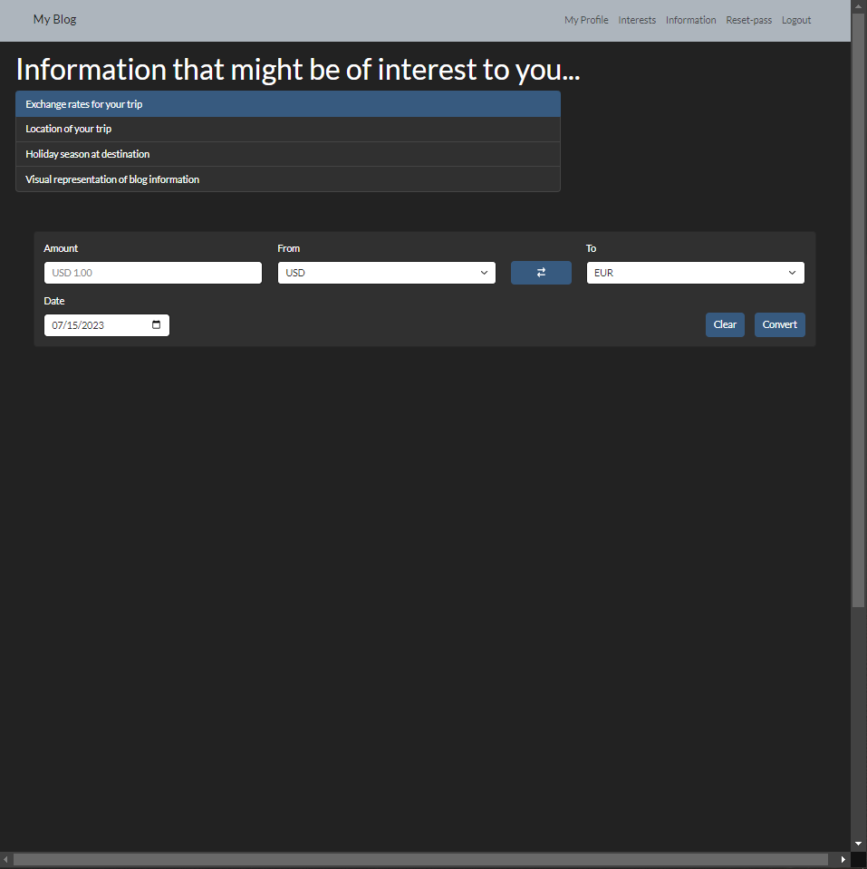
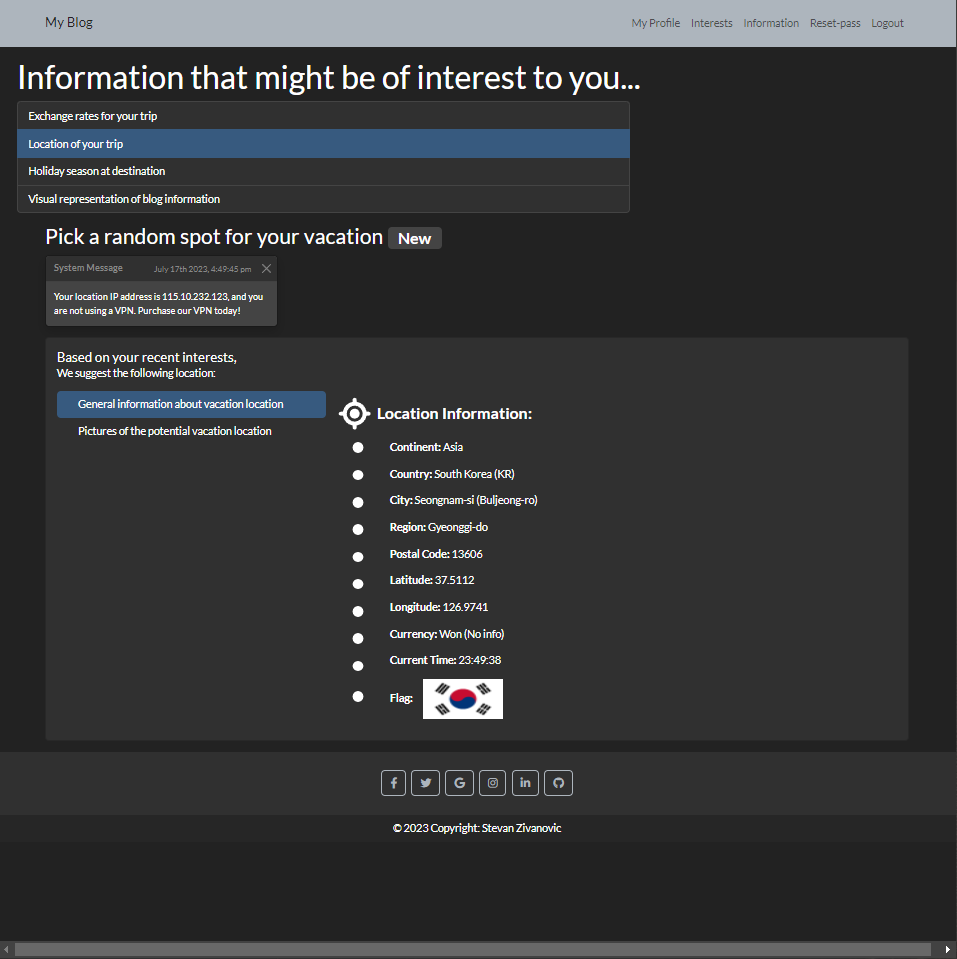
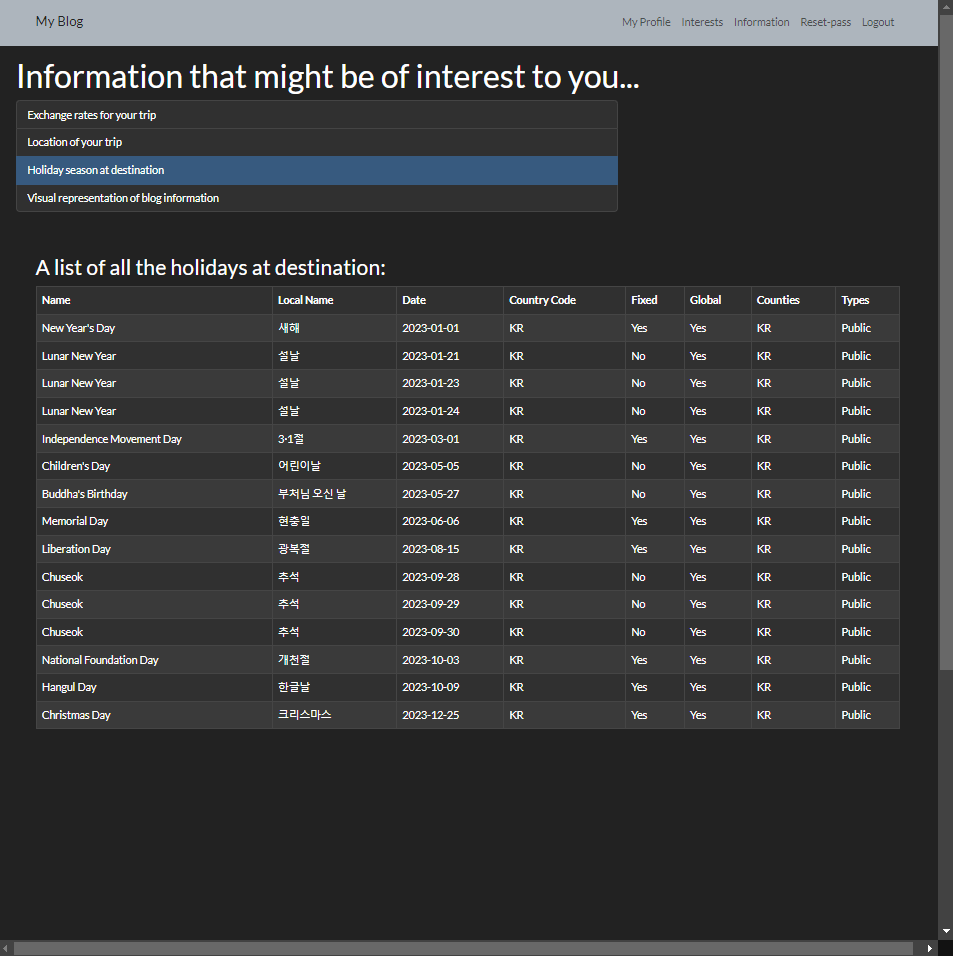
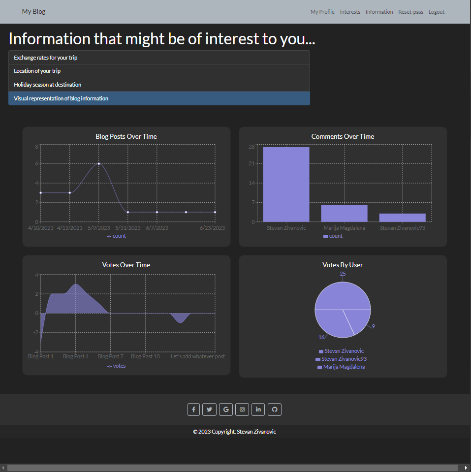

## Table of Contents
1. [Project Status](#project-status)
2. [Project Screenshots](#project-screenshots)
3. [Installation and Setup Instructions](#installation-and-setup-instructions)
4. [Features](#usage-or-features)
5. [Technologies](#technologies)
6. [Reflection](#reflection)
7. [Contributing](#contributing)
8. [License](#license)

## My Blog - share your ideas with the world!

An application with CRUD functionality, via which users can create and modify blog posts, comments, votes and more! Built with React, JavaScript, and Bootstrap. 

## Project Status

This project is complete. Tests remain to be conducted on some components, but the project should be fully functional and working without any pending issues. If you do notice some issues, feedback is appriciated at the following e-mail: stevanzivanovic48@gmail.com 

## Project Screen Shot(s)  

Before login

Login

Logged in

Add blog post modal

Profile Page

Interests Page

Information Page - part 1

Information Page - part 2

Information Page - part 3

Information Page - part 4

## Installation and Setup Instructions

Clone down this repository. You will need `node` and `npm` installed globally on your machine. You will also need to clone my other repository, the blog-project-backend. To use the blog-project-backend, please create a new .env file at the root of the directory. You will need to provide the port on which you would like for the project to run locally on (PORT), your own mongoDB credentails (MONGO_URL), a jwt secret and lifetime (JWT_SECRET, JWT_LIFETIME), your own cloudinary name, api key, secret (CLOUDINARY_NAME, CLOUDINARY_API_KEY, CLOUDINARY_API_SECRET), as well as a sendgrid api key (SENDGRID_API_KEY). Once this process is completed, please move into the blog-project-frontend directory. In the root of the directory, please create another .env file. In this .env file, you will need to add an unsplash access key (REACT_APP_UNSPLASH_ACCESS_KEY), as well as an abstract exchange, location, and holiday api key (REACT_APP_ABSTRACT_EXCHANGE_API_KEY, REACT_APP_ABSTRACT_LOCATION_API_KEY, and REACT_APP_ABSTRACT_HOLIDAY_API_KEY).      

Installation:

Once the .env files are populated on the backend and the frontend, please run the npm install command in both directories.  
To Run Test Suite:  

`npm test`  

To Start Server:

`npm start`  

To Visit App:

`localhost:3000`

## Features

Complex State Management: The application manages a complex state operation with over 30 routes going to the backend. This was achieved using the useContext and useReducer React hooks across 5 different context files and corresponding reducer files.

Password Reset Functionality: The application provides a comprehensive password reset functionality. Users can reset their password if they know their current password. If they don't, the application provides a secure way to reset it via email.

Image Upload: Users can upload images for their profile picture and blog posts. The application supports both file uploads and URL inputs. This was implemented using Cloudinary for image hosting.

Voting System: The application features a Reddit-like voting system for blog posts and comments. Users can upvote, downvote, or remove their vote from a blog post or a comment. The voting system is implemented in a way that a user can change their vote from upvote to downvote and vice versa.

Optimized Data Fetching: To improve performance, the application implements an optimized data fetching system. It includes features like limit, sort, and order for blog posts, and a debounced scroll to load more function. This was achieved by creating separate routes for blogs, comments, and votes on the backend.

Custom Hooks: The application uses custom hooks throughout the project to encapsulate and reuse stateful logic.

Additional Features: The application includes a currency exchange converter and a visual representation of blog, comments, and votes data using the Recharts library.

## Technologies

This project was built using a variety of technologies and libraries to provide a rich, interactive user experience. Here are some of the key technologies used:

React: The application's UI was built using React, a popular JavaScript library for building user interfaces.

React Router DOM: This was used for managing the routing in the application, allowing for seamless navigation across different components.

Bootstrap: This was used for styling the application and making it responsive across different screen sizes.

Axios: This was used for making HTTP requests to the backend.

Classnames: This was used for conditional rendering of class names in the application.

History: This was used for managing session history in the application.

Leaflet and React-Leaflet: These were used for implementing interactive maps in the application.

React-Responsive: This was used for making the application responsive and optimizing the UI for different screen sizes.

Recharts: This was used for visualizing blog, comments, and votes data in the application.

UUID: This was used for generating unique identifiers.

Moment: This was used for parsing, validating, manipulating, and displaying dates and times in JavaScript.

The application was bootstrapped with create-react-app to minimize initial setup and allow more time for feature development. In the future, I'm excited to explore and implement different technologies in other projects!

## Reflection
   
This was a three month long project built upon completion of various Udemy coursework. Project goals included using technologies learned up until this point and familiarizing myself with documentation for new features.

I wanted to build a blog project that allowed users to create, read, update and delete blog posts, comments, and votes. In the meantime, the application grew as I've expanded on various sections of the project to better my programming skillset. I started this process by using the `create-react-app` boilerplate, then adding `react-router-dom` and `bootstrap`.

This is the first full stack project that I've ever built, so there were numerous challenges and obstacles along the way. Here's some of them: 

  - Managing a complex state operation with over 30 routes going to the backend. This required multiple refactors of the context state implemented using the useContext and useReducer react hooks. To manage all of these different routes, I had to prepare a total of 5 different context files, together with corresponding reducer files. It was indeed quite a feat to get all the routes working properly and for them to execute in order. I've run into and resolved multiple race conditions  during the development of this project, which is quite a complex topic for a beginner programmer like me.
  - To push myself further and develop my skillset, I've implemented a reset password functionality. The easy part was implementing resetting of password when the user already knows their password. But when the user doesn't know their password required sending data back and forth between the frontend and backend. For this, I had to implement two complex forms on the frontend and two complex routes on the backend to handle this logic. As a middleware for this functionality, I've used @sendgrid/mail. All of the forms are rendered on the same page depending on various props.
  - To add and edit blog posts, I've implemented modals. What's special here is that I've added the ability to add files or images at the same time for either the profile picture or the blog post pictures. For example, you could upload a profile picture and one image for a blog post and use URLs for the remaining two images. This functionality was quite complex to implement, as it involves sending images to the backend, upon which the backend responds with URLs of the uploaded images. Once we receive the URLs on the frontend, they are plugged into the addBlogPost / editBlogPost dispatch functions. This was a simpler alternative that I came up with as opposed to using multipart/formdata. The whole process is stateless, we are just sending data back and forth. For this, I've used cloudinary and that invloved some regex as well.
  - Once I've implemented CRUD functionality for blog posts and comments, I was at a bit of a loss as to what I could implement next. Then I remembered that reddit uses a vote based system for blog posts and comments, so I said to myself - why wouldn't I implement something like that! For this, I've created a new type of object that is linked to both blog posts and comments. This object has a single vote property, which can be either -1, 0, or 1, depending on what the user chooses on the frontend. If the user downvotes a post or a comment, this creates a new object with the vote property of -1. If the user upvotes a post or a comment, this creates a new object with the vote property of 1. If they chose to remove their vote from a blog post or a comment, this modifies the existing vote to 0. This also means that a user can change their vote from 1 to -1, or from -1 to 1, which would again modify only the existing vote object. To handle this logic, I've created two different routes, one for blog posts and another one for comments. These routes both created or updated a vote object depending on the choices of the user. Here I would also like to point out the complexity of deleting a blog post, since this involves (in order) deleting all comment vote objects fpr a blog post, deletion of all comments for a blog post, deletion of the blog vote objects, finally deletion of the blog posts themselves.
  - After a while, I've noticed that it took longer and longer periods of time for the blog posts, comments, and votes to fully load. Upon investigaiton, the issues were glaringly obvious - the amount of data increased as the project went on. To reduce the load under which the application operates, I've had to implement a completely new route for fetching of blog posts. While I was at it, I've added the ability to limit, sort, and order the blog posts coming from the backend depending on the users choices. But that's not all - I've also added a debounced scroll to load more function. Once the user reaches the bottom of the page, additional blog posts are fetched! All of this involved a lot of research, trial and error to get right. As the blog posts come in from the backend, I extracted their ids, which I've used to fetch the comments, followed by the votes as well. Depending on whether we are on the first page of posts or any other, the data being fetched and processed is different. To make this all work, for a single route on the frontend, I had to create three different routes on the backend, one of each for blogs, comments, and votes. Once the blog posts were optimized, I've decided to optimize the fetching of comments as well. Here I would like to point out the main difference between the two - the loading of additional blog posts, limits, sort, and order are a one way street for the blog posts - data goes from the frontend to the backend and additional posts are fetched. For the comments it's different - we are using one route for the initial fetch, then a different route for each subsequent fetch of comments on the backend. Here the user also has an ability to sort the comments on the frontend - depending on their sort of the already existing comments, do we fetch additional comments from the backend. All of this involved quite complex logic, which is evident from the code itself.
  - There are some custom hooks implemented as well, which are used all over the project, in some places multiple times. In the end, I've also decided to add as a practice for myself a currency exchange converter, and a visual representation of the blog, comments and votes data with the recharts library. Since the project was starting to get quite large and complex for me, I've decided to stop here with additional functionalities. Since then, I've been constantly working on debugging the app, writing tests using jest and in general trying to follow all the best practices when refactoring.

## Contributions
At this time, the best way to contribute is by providing feedback on any issues you encounter. Please email your feedback to stevanzivanovic48@gmail.com. As I become more familiar with GitHub and open source workflows, I plan to open up this project for more direct contributions. Thank you for your understanding and support!

## License
This project is open source, and as such, the code is available for anyone to look at. However, I haven't yet chosen a specific open source license, so please respect the unlicensed nature of the project for now. I'm currently learning more about open source licenses and will update this section once I've chosen a license that fits the project's needs.
